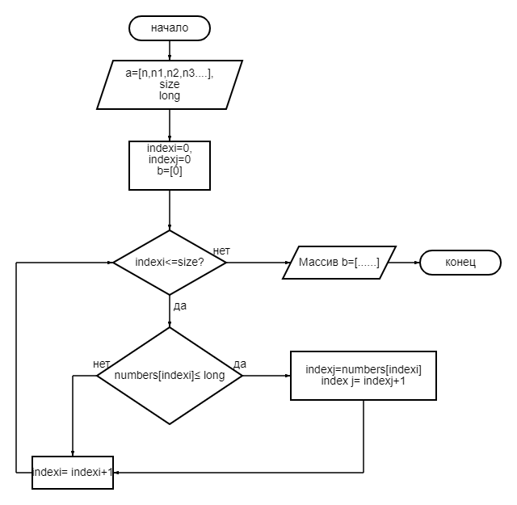

О программе:
Данная программа позволяет формировать из заданного массива на старте программы сформировать новый массив из стро, длина которых меньше или равна 3 символам.

Блок- схема к массиву представлена ниже:
. 